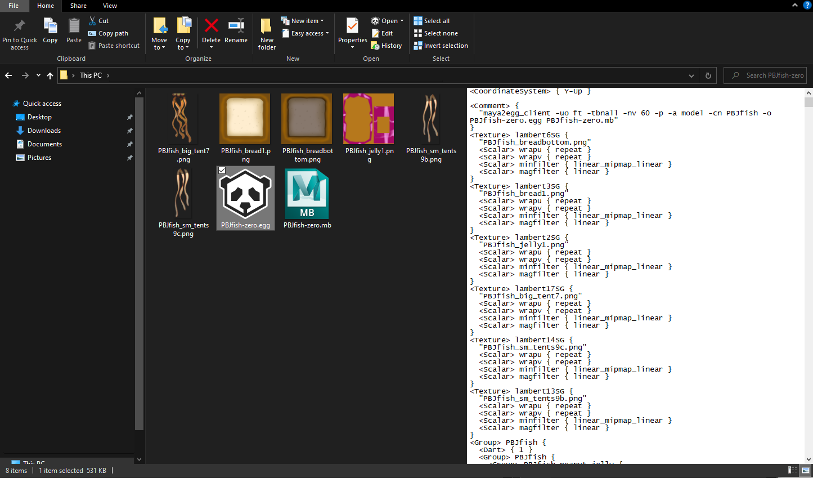

# Panda3D Registry Add-ons

This was mostly created for personal use, so installation of these keys may require a bit of custom configuration to suite your own preferences. **The preinstallation and installation guides below are subject to change at any time!**

## Features

**General:**
- Support for previewing the contents of egg files in Windows Explorer's preview pane.

### Panda3D Context Menu Shortcuts

**Eggfiles:**
- Convert to Bamfile

**Bamfiles:**
- Strong flatten

## Preinstallation

**NOTICE 7/25/22:** Newer Panda3D versions do NOT use ``egg_auto_file`` or ``bam_auto_file``. Instead, they use ``Panda3D.Model``

To ensure these context menus function as intended, let's ensure that we install our keys into the correct location. Note that you must have administrator privileges to modify and install keys to the registry. Additionally, please see my **disclaimer below** before deciding to continue.

- Open Registry Editor (``regedit.exe``) and go to the ``HKEY_CLASSES_ROOT`` directory. 
- Search and ensure that the ``.bam`` and ``.egg`` file extension keys exist.
- For each key, click on it (the folder icon) and take note on what the Data is for the ``(Default)`` string value.
- By default, these keys assume that the data is ``bam_auto_file`` and ``egg_auto_file`` respectively for each extension. 
	- If this is not the case, you will need to edit the registry keys (provided in this repo) and replace ``bam_auto_file``/``egg_auto_file`` with whatever the data value is for each of them.

## Installation

1) Copy all of the **python** scripts to a directory called "registry" on the root of your C:\ drive. (``C:\registry``)
2) Install the registry keys by double clicking on them.
3) Open Registry Editor (if it isn't open already) and go to the ``Computer\HKEY_CURRENT_USER\SOFTWARE\Classes`` directory. Look for the keys noted from the preinstallation steps (ex: ``Computer\HKEY_CURRENT_USER\SOFTWARE\Classes\bam_auto_file``) and enter the ``shell`` subfolder. You should see multiple folders here.
4) Besides the ``open`` key (as it's preconfigured by default,) double click on each key and click on the ``command`` key.
5) **Ensure that the executable paths are correct and configured as desired.** For example, if you don't want to have the python scripts located in ``C:\registry``, configure these values to point to the appropriate directory instead.
6) If all works as intended, you should now be able to view these shortcuts when you right click on a bam/egg file! *(Does not require restarting your computer.)*

## Todo

- Instead of defaulting to ``C:\Panda3D-1.11.0-x64``, should introduce creating an environment variable and base the path off it (ie ``%PYTHONPATH_PANDA3D%``)

- Probably same thing as above but for the ``C:\registry`` folder.

- Make a script or something that auto detects the Data contents for the ``.egg`` and ``.bam`` keys and properly installs/configures the scripts to install in that respected key instead.

## Disclaimer

Modifying the registry can be *dangerous* if done incorrectly. Traditionally, guides will tell you to backup registries before installing new keys from the Internet. While it would be a bit redundant to backup your *entire* registry for preparing to install these keys, it is generally good practice to keep backups of your registry keys somewhere in case something ever goes wrong. It is also a great idea to export your ``.bam`` and ``.egg`` keys before doing any modifications, in case something does go wrong.

That being said, I am not responsible for anything if something ends up going wrong (which it shouldn't.) Use at your own risk.